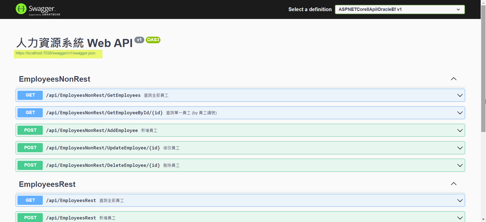

# ASP.NET Core 8 Web API 使用 Oracle.EntityFrameworkCore 存取 Oracle, 並使用 Swagger/OpenAPI 工具進行測試

## Access Oracle with Oracle.EntityFrameworkCore in ASP.NET Core 8 Web API, and Test by  Swagger/OpenAPI Tools

由於工作上會用到 ASP.NET Core 8 Web API 存取 Oracle 資料庫. 目前查到的方式有 2 種:  
1.. 利用 Dapper 作為中介, 直接下 SQL 指令.  
2.. 利用 Entity Framework Core 作為中介, 由其將 Entity Framework 的物件內容, 轉為 SQL 指令.  

筆者已習慣採用 Entity Framework Core + MSSQL, 所以這篇就來試試 Entity Framework Core + Oracle.  

撰寫完成的 Web API 總是要測試, 本文採用 Swagger/OpenAPI 的相關套件及工具, 進行測試.  

內容大綱如下:  

一. [環境](#section1)  
二. [步驟](#section2)  
(一) [安裝 dotnet-ef 命令列工具 至最新版](#section2-1)  
(二) [建立 Web API 專案](#section2-2)  
(三) [加入 Microsoft.EntityFrameworkCore.Tools 套件](#section2-3)  
(四) [加入 Oracle.EntityFrameworkCore 套件](#section2-4)  
(五) [建立 Oracle 資料庫, 使用者及 Table](#section2-5)  
(六) [由 Oracle 資料庫產生 DbContext 及 Models](#section2-6)  
(七) [撰寫 Web API](#section2-7)  
(八) [將程式進行優化](#section2-8)  
(九) [利用 Swashbuckle.AspNetCore 套件產生 Web API 的說明頁面](#section2-9)  
(十) [利用 NSwag.AspNetCore 套件產生 Web API 的說明頁面](#section2-10)  
(十一) [利用 NSwagStudio 工具產生用戶端的程式碼](#section2-11)  
附錄一: [Oracle.EntityFranewrokCore 安裝後的提示](#sectionA)  
附錄二: [EF Core Power Tools 執行完成的提示](#sectionB)  

範例由此下載.  

<!-- more --> 

## 一. 環境 <a id="section1"></a>

* Visual Studio 2022  
* ASP.NET Core 8 Web API  
* 工具  
  * dotnet-ef 命令列工具  
* Nuget 套件  
  * Microsoft.EntityFrameworkCore.Tools  
  * Oracle.EntityFrameworkCore  

## 二. 步驟 <a id="section2"></a>

### (一) 安裝 dotnet-ef 命令列工具 至最新版 <a id="section2-1"></a>
```powershell
PS D:\Temp> dotnet tool install --global dotnet-ef

歡迎使用 .NET 8.0!
---------------------
SDK 版本: 8.0.204

-----------
已成功將工具 'dotnet-ef' 從 '7.0.12' 版更新為 '8.0.4' 版。
```

### (二) 建立 Web API 專案 <a id="section2-2"></a>

1.. 方式1: 利用 Visual Studio 2022 直接建立 Web API 專案.  
截圖 (略).  

2.. 方式2: 利用 dotnet cli 建立 Web API 專案; 再以 Visual Studio 2022 打開.   
```powershell
PS D:\Temp> dotnet new webapi -n ASPNETCore8ApiIOracleEf --use-controllers
範本「ASP.NET Core Web API」已成功建立。
還原成功。
```

### (三) 加入 Microsoft.EntityFrameworkCore.Tools 套件 <a id="section2-3"></a>
1.. 方式1: Visual Studio 2022 的 Nuget 套件管理員.  
  

2.. 方式2: 利用 dotnet cli 加入套件.  
```powershell
PS D:\Temp\ASPNETCore8ApiIOracleEf> dotnet add package Microsoft.EntityFrameworkCore.Tools
  正在判斷要還原的專案...
  Writing C:\Users\jasperlai\AppData\Local\Temp\tmpfy2mol.tmp
info : X.509 certificate chain validation will use the default trust store selected by .NET for code signing.
info : X.509 certificate chain validation will use the default trust store selected by .NET for timestamping.
info : 正在將套件 'Microsoft.EntityFrameworkCore.Tools' 的 PackageReference 新增至專案 'D:\Temp\ASPNETCore8ApiIOracleEf\ASPNETCore8ApiIOracleEf.csproj'。
info :   GET https://api.nuget.org/v3/registration5-gz-semver2/microsoft.entityframeworkcore.tools/index.json
~~~
log  : 已還原 D:\Temp\ASPNETCore8ApiIOracleEf\ASPNETCore8ApiIOracleEf.csproj (8.31 sec 內)。
```

### (四) 加入 Oracle.EntityFrameworkCore 套件 <a id="section2-4"></a>
1.. 方式1: Visual Studio 2022 的 Nuget 套件管理員.  
  

2.. 方式2: 利用 dotnet cli 加入套件.  
```powershell
PS D:\Temp\ASPNETCore8ApiIOracleEf> dotnet add package Oracle.EntityFrameworkCore
  正在判斷要還原的專案...
  Writing C:\Users\jasperlai\AppData\Local\Temp\tmpd3frzd.tmp
info : X.509 certificate chain validation will use the default trust store selected by .NET for code signing.
info : X.509 certificate chain validation will use the default trust store selected by .NET for timestamping.
info : 正在將套件 'Oracle.EntityFrameworkCore' 的 PackageReference 新增至專案 'D:\Temp\ASPNETCore8ApiIOracleEf\ASPNETCore8ApiIOracleEf.csproj'。
~~~
log  : 已還原 D:\Temp\ASPNETCore8ApiIOracleEf\ASPNETCore8ApiIOracleEf.csproj (15.1 sec 內)。
```

### (五) 建立 Oracle 資料庫, 使用者及 Table <a id="section2-5"></a> 

參考 <a href="https://www.jasperstudy.com/2024/03/oracle-cdb-pdb.html" target="_blank">Oracle 的容器資料庫(CDB) 與 可拔插資料庫(PDB)</a> 建立相關的環境.  

建立完成的 Oracle 環境為: 

* Oracle 23c Free 版本的 Oracle 資料庫執行個體.  
* 可拔插資料庫 的使用者帳/密: JASPER / Test1234.  
* 建立的 Table:

```sql
-- 建立 table: EMPLOYEE
CREATE TABLE EMPLOYEE (
    Id NUMBER GENERATED AS IDENTITY,
    Name NVARCHAR2(32),
    Address NVARCHAR2(128),
    Photo BLOB,
    CONSTRAINT PK_EMPLOYEE PRIMARY KEY (Id)
);

-- 新增資料
INSERT INTO "JASPER"."EMPLOYEE" (NAME, ADDRESS) VALUES (N'JASPER', N'台北市');
```

以下為 Oracle SQL Developer 連接的截圖.  
  

### (六) 由 Oracle 資料庫產生 DbContext 及 Models <a id="section2-6"></a>

1.. 設定 TNS_ADMIN 環境變數.  

(1) 暫時性  
```powershell
$env:TNS_ADMIN = "D:\OracleApp\instant_client\instantclient_21_13\network\admin"
```

(2) 寫入至使用者環境變數  
```powershell
[System.Environment]::SetEnvironmentVariable("TNS_ADMIN", "D:\OracleApp\instant_client\instantclient_21_13\network\admin", [System.EnvironmentVariableTarget]::User)
```

2.. 產生 DbContext 及 Models  

(1) 方式1: 使用 Oracle Developer Tools for Visual Studio 2022 + EF Core Power Tools  
備註1: 需先安裝 <a href="https://marketplace.visualstudio.com/items?itemName=OracleCorporation.OracleDeveloperToolsForVisualStudio2022&ssr=false#review-details" target="_blank">Oracle Developer Tools for Visual Studio 2022</a>  
**備註2: 完成後, 會產生附錄二的說明文件; 必須依此文件調整程式.**  

  
  
  
  

  
  
  
  
  
  
  

注意: 這個 [V]使用可為空的參考類型, 就是 Nullable Reference Type (C# 8 開始), 建議打 V.  
  

(2) 方式2: 採用 dotnet-ef 命令列工具  
```powershell
PS D:\Temp\ASPNETCore8ApiIOracleEf> dotnet ef dbcontext scaffold "User Id=JASPER;Password=Test1234;Data Source=MYPDB1;" "Oracle.EntityFrameworkCore" --output-dir Models --context HrDbContext --table EMPLOYEE
Build started...
Build succeeded.
To protect potentially sensitive information in your connection string, you should move it out of source code. You can avoid scaffolding the connection string by using the Name= syntax to read it from configuration - see https://go.microsoft.com/fwlink/?linkid=2131148. For more guidance on storing connection strings, see https://go.microsoft.com/fwlink/?LinkId=723263.
```

(3) 方式1 的輸出結果:

* HrDbContext.cs  

```csharp
public partial class HrDbContext : DbContext
{
    public HrDbContext()
    {
    }

    public HrDbContext(DbContextOptions<HrDbContext> options)
        : base(options)
    {
    }

    public virtual DbSet<Employee> Employees { get; set; }

    protected override void OnConfiguring(DbContextOptionsBuilder optionsBuilder)
#warning To protect potentially sensitive information in your connection string, you should move it out of source code. You can avoid scaffolding the connection string by using the Name= syntax to read it from configuration - see https://go.microsoft.com/fwlink/?linkid=2131148. For more guidance on storing connection strings, see https://go.microsoft.com/fwlink/?LinkId=723263.
        => optionsBuilder.UseOracle("DATA SOURCE=MYPDB1;TNS_ADMIN=D:\\OracleApp\\instant_client\\instantclient_21_13\\network\\admin;PASSWORD=Test1234;PERSIST SECURITY INFO=True;USER ID=JASPER");

    protected override void OnModelCreating(ModelBuilder modelBuilder)
    {
        modelBuilder
            .HasDefaultSchema("JASPER")
            .UseCollation("USING_NLS_COMP");

        modelBuilder.Entity<Employee>(entity =>
        {
            entity.ToTable("EMPLOYEE");

            entity.Property(e => e.Id)
                .ValueGeneratedOnAdd()
                .HasColumnType("NUMBER")
                .HasColumnName("ID");
            entity.Property(e => e.Address)
                .HasMaxLength(128)
                .HasColumnName("ADDRESS");
            entity.Property(e => e.Name)
                .HasMaxLength(32)
                .HasColumnName("NAME");
            entity.Property(e => e.Photo)
                .HasColumnType("BLOB")
                .HasColumnName("PHOTO");
        });

        OnModelCreatingPartial(modelBuilder);
    }

    partial void OnModelCreatingPartial(ModelBuilder modelBuilder);
}
```

* Employee.cs  
注意: 它有多了一個 #nullable enable 編譯指示. 其實如果不加, 預設 .csproj 也是設成 nullable enable.    
```csharp
#nullable enable
public partial class Employee
{
    public decimal Id { get; set; }
    public string? Name { get; set; }
    public string? Address { get; set; }
    public byte[]? Photo { get; set; }
}
```

* .csproj
```xml
<Nullable>enable</Nullable>
```

(4) 方式2 的輸出結果:

* Employee.cs:  
```csharp
public partial class Employee
{
    public decimal Id { get; set; }
    public string? Name { get; set; }
    public string? Address { get; set; }
    public byte[]? Photo { get; set; }
}
```

### (七) 撰寫 Web API <a id="section2-7"></a>

1.. EmployeesController.cs  

```csharp
    [Route("api/[controller]")]
    [ApiController]
    public class EmployeesController : ControllerBase
    {
        private readonly HrDbContext _context;

        public EmployeesController(HrDbContext context)
        {
            _context = context;
        }

        // GET: api/Employees
        [HttpGet]
        public async Task<ActionResult<IEnumerable<Employee>>> GetEmployees()
        {
            return await _context.Employees.ToListAsync();
        }

        // GET: api/Employees/5
        [HttpGet("{id}")]
        public async Task<ActionResult<Employee>> GetEmployee(decimal id)
        {
            var employee = await _context.Employees.FindAsync(id);

            if (employee == null)
            {
                return NotFound();
            }

            return employee;
        }

        // PUT: api/Employees/5
        // To protect from overposting attacks, see https://go.microsoft.com/fwlink/?linkid=2123754
        [HttpPut("{id}")]
        public async Task<IActionResult> PutEmployee(decimal id, Employee employee)
        {
            if (id != employee.Id)
            {
                return BadRequest();
            }

            _context.Entry(employee).State = EntityState.Modified;

            try
            {
                await _context.SaveChangesAsync();
            }
            catch (DbUpdateConcurrencyException)
            {
                if (!EmployeeExists(id))
                {
                    return NotFound();
                }
                else
                {
                    throw;
                }
            }

            return NoContent();
        }

        // POST: api/Employees
        // To protect from overposting attacks, see https://go.microsoft.com/fwlink/?linkid=2123754
        [HttpPost]
        public async Task<ActionResult<Employee>> PostEmployee(Employee employee)
        {
            _context.Employees.Add(employee);
            await _context.SaveChangesAsync();

            return CreatedAtAction("GetEmployee", new { id = employee.Id }, employee);
        }

        // DELETE: api/Employees/5
        [HttpDelete("{id}")]
        public async Task<IActionResult> DeleteEmployee(decimal id)
        {
            var employee = await _context.Employees.FindAsync(id);
            if (employee == null)
            {
                return NotFound();
            }

            _context.Employees.Remove(employee);
            await _context.SaveChangesAsync();

            return NoContent();
        }

        private bool EmployeeExists(decimal id)
        {
            return _context.Employees.Any(e => e.Id == id);
        }
    }

```

2.. Program.cs  
```csharp
var builder = WebApplication.CreateBuilder(args);

// Add services to the container.
#region 加入 Oracle 資料庫連結服務 至 DI
builder.Services.AddDbContext<HrDbContext>(
    options => options.UseOracle(builder.Configuration.GetConnectionString("HrConnection")));
#endregion

builder.Services.AddControllers();
// Learn more about configuring Swagger/OpenAPI at https://aka.ms/aspnetcore/swashbuckle
builder.Services.AddEndpointsApiExplorer();

var app = builder.Build();

// Configure the HTTP request pipeline.
if (app.Environment.IsDevelopment())
{
    app.UseSwagger();
    app.UseSwaggerUI();
}

app.UseHttpsRedirection();
app.UseAuthorization();
app.MapControllers();

app.Run();
```

3.. appsettings.json  
```json
{
  "Logging": {
    "LogLevel": {
      "Default": "Information",
      "Microsoft.AspNetCore": "Warning"
    }
  },
  "ConnectionStrings": {
    "HrConnection": "DATA SOURCE=MYPDB1;TNS_ADMIN=D:\\OracleApp\\instant_client\\instantclient_21_13\\network\\admin;PASSWORD=Test1234;PERSIST SECURITY INFO=True;USER ID=JASPER"
  },
  "AllowedHosts": "*"
}
```

### (八) 將程式進行優化 <a id="section2-8"></a> 

1.. 加入 EmployeeViewModel.cs, 以避免使用者接觸到 Database Model, 例如: Employee.cs

```csharp
/// <summary>
/// 員工基本資料
/// </summary>
public class EmployeeViewModel
{
    /// <summary>
    /// 員工編號
    /// </summary>
    [Display(Name = "員工編號")]
    public decimal Id { get; set; }

    /// <summary>
    /// 員工姓名
    /// </summary>
    [Display(Name = "員工姓名")]
    public string? Name { get; set; } = string.Empty;

    /// <summary>
    /// 員工住址
    /// </summary>
    [Display(Name = "員工住址")]
    public string? Address { get; set; } = string.Empty;

    /// <summary>
    /// 員工照片
    /// </summary>
    [Display(Name = "員工照片")]
    public byte[]? Photo { get; set; }
}
```

2.. **將 (七) 的 EmployeesController.cs 的程式內容, 拆為 Controller 及 Service Layer.**  
(1) Controller Layer:  
* EmployeesRestController / EmployeesNonRestController: 接收或回傳 EmployeeViewModel 的內容.  
  * EmployeesRestController: 採用 REST 的方式, 支援 GET, POST, PUT, DELETE 這 4 個 HTTP Method  
  * EmployeesNonRestController: 採用 non-REST 的方式, 支援 GET, POST 這 2 個 HTTP Method  

(2) Service Layer:  
* EmployeesService:   
  * 將傳入的 EmployeeViewModel 轉為 Employee, 寫入資料庫, 或  
  * 將傳入的查詢條件, 送至資料庫查詢, 取出 Employee, 轉為 EmployeeViewModel, 再回傳給 EmployeesRestController.  

(3) **由於程式碼內容蠻單純的, 請自行查看原始程式碼, 這裡就不贅述.**  

### (九) 利用 Swashbuckle.AspNetCore 套件產生 Web API 的說明頁面 <a id="section2-9"></a>

ASP.NET Core 8 Web API 預設是採用 Swashbuckle.AspNetCore 套件. 若要產出 Xml Document, 讓整個 Web API 可以添加更多描述資訊 (例如: 各個 Metohd 中文說明, 各個輸出入物件描述), 可以參考 <a href="https://learn.microsoft.com/zh-tw/aspnet/core/tutorials/getting-started-with-swashbuckle?view=aspnetcore-8.0&tabs=visual-studio" target="_blank">(Microsoft) 開始使用 Swashbuckle 及 ASP.NET Core</a> 這篇文章. 本文是採用這個預設的方式.  

1.. 調整專案屬性:  
  
  
前述 2 個設定都是 OK 的, 筆者偏向採用不設定, 比較單純

  

2.. 調整 Program.cs:  
```csharp
#region 調整 AddSwaggerGen() 的選項, 使其可以讀取 Xml Document
builder.Services.AddSwaggerGen(c =>
{
    c.SwaggerDoc("v1", new OpenApiInfo { Title = "人力資源系統 Web API", Version = "v1" });
    // Set the comments path for the Swagger JSON and UI.
    var xmlFile = $"{Assembly.GetExecutingAssembly().GetName().Name}.xml";
    var xmlPath = Path.Combine(AppContext.BaseDirectory, xmlFile);
    c.IncludeXmlComments(xmlPath);
});
#endregion
```

3.. 看一下 Web API 的說明頁面.  
  
  

### (十) 利用 NSwag.AspNetCore 套件產生 Web API 的說明頁面 <a id="section2-10"></a>

另一個方式是採用 NSwag 套件, 它除了可以產生文件之外, 還可產生呼叫端的程式碼, 細節可以參考 <a href="https://blog.miniasp.com/post/2019/12/21/ASP%E2%80%A4NET-Core-3-NSwag-OpenAPI-v3" target="_blank">(Will保哥) 如何在 ASP․NET Core 3 完整設定 NSwag 與 OpenAPI v3 文件</a> 這篇文章.  

1.. 加入 NSwag.AspNetCore 套件. (目前版本為 14.0.7)  
(1) 在 VS Code 可以採用以下指令安裝.  
```powershell
dotnet add ASPNETCore8ApiIOracleEf.csproj package NSwag.AspNetCore
```
(2) 在 Visual Studio 2022 可用 Nuget 套件管理員, 這裡就不截圖了.  

2.. 留意 .csproj 的設定.  
以下這 2 個設定還是要有, 不然中文描述就無法產生了.

```xml
<GenerateDocumentationFile>True</GenerateDocumentationFile>
<NoWarn>$(NoWarn);1591</NoWarn>
```

3.. 調整 Program.cs:  

```csharp
#region 將 AddOpenApiDocument() 服務, 註冊至 DI
// Add OpenAPI v3 document
builder.Services.AddOpenApiDocument(settings =>
{
    settings.Title = "人力資源系統 Web API";
    settings.Version = "v1";
    settings.Description = "人力資源系統: 提供人員及部門管理的功能";
});

// Add Swagger v2 document
// services.AddSwaggerDocument();
#endregion
```

```csharp
if (app.Environment.IsDevelopment())
{

    //#region 啟用 Swagger 相關的 middleware
    ////app.UseSwagger();
    ////app.UseSwaggerUI();
    //#endregion

    #region 啟用 NSwag 相關的 middleware
    // Add OpenAPI 3.0 document serving middleware
    // Available at: http://localhost:<port>/swagger/v1/swagger.json
    app.UseOpenApi();

    // Add web UIs to interact with the document
    // Available at: http://localhost:<port>/swagger
    app.UseSwaggerUi();
    #endregion

    #region 啟用 ReDoc 相關的 middleware
    // 註1: ReDoc 是在 NSwag.AspNetCore 的 NSwagApplicationBuilderExtensions 類別裡
    // 註2: ReDoc 的側邊欄導航使得查找特定端點, 模型和文檔部分更加直觀和快速
    //     它沒有內建測試的功能, 純粹文件檢視
    app.UseReDoc(config =>  // serve ReDoc UI
    {
        // 這裡的 Path 用來設定 ReDoc UI 的路由 (網址路徑) (一定要以 / 斜線開頭)
        // Available at: http://localhost:<port>/redoc
        config.Path = "/redoc";
    }); 
    #endregion
}
```

4.. 看一下 Web API 的說明頁面.

(1) Swagger UI
  
  

(2) ReDoc
  


### (十一) 利用 NSwagStudio 工具產生用戶端的程式碼 <a id="section2-11"></a>

1.. 安裝 <a href="https://github.com/RicoSuter/NSwag/wiki/NSwagStudio" target="_blank">NSwagStudio</a>  
2.. 產生 TypeScript, C# Client 的用戶端.  
註: 下圖的 C# Controller 是由 OpenAPI 文件產出的 Controller, 不是用戶端.  

(1) 選擇平台: .NET 的版本.  
(2) 輸入 OpenAPI 文件連結: https://localhost:7038/swagger/v1/swagger.json   
(3) 選擇所需的產出項目.  
(4) 按下 [Generate Outputs].  

  


## 參考文件

* <a href="https://learn.microsoft.com/en-us/ef/core/get-started/overview/install" target="_blank">(Microsoft) Installing Entity Framework Core </a>  
> 描述如何安裝 EF Core 的環境: 主要是安裝 Entity Framework Core Tools 及各資料庫對應竹旳 EF Core Framework (例如:  Microsoft.EntityFrameworkCore.SqlServer, Oracle.EntityFrameworkCore)

* <a href="https://learn.microsoft.com/en-us/ef/core/cli/dotnet" target="_blank">(Microsoft) Entity Framework Core tools reference - .NET Core CLI</a>  
> dotnet ef 的命令列工具, 例如: dotnet ef dbcontext scaffold 可以由資料庫反推產生對應的 DbContext 及 Models

<a href="https://www.jasperstudy.com/2024/03/oracle-cdb-pdb.html" target="_blank">(傑士伯的IT學習之路) Oracle 的容器資料庫(CDB) 與 可拔插資料庫(PDB)</a>  

* <a href="https://docs.oracle.com/en/database/oracle/oracle-data-access-components/19.3/odpnt/ODPEFCore.html" target="_blank">(Oracle) Oracle Data Provider for .NET Entity Framework Core</a>  

* <a href="https://ithelp.ithome.com.tw/articles/10229661" target="_blank">(iT邦幫忙)(WM) .NET Core 3.1 with Oracle 12c</a>  

* <a href="https://blog.darkthread.net/blog/ef-core-notes-4/" target="_blank">(黑暗執行緒) EF Core 筆記 4 - 跨資料庫能力展示</a>  

* <a href="https://www.nuget.org/packages/Z.EntityFramework.Plus.EFCore" target="_blank">(Nuget) Z.EntityFramework.Plus.EFCore</a>  

* <a href="https://github.com/zzzprojects/EntityFramework-Plus" target="_blank">(GitHub)(zzzprojects) EntityFramework-Plus</a>  

* <a href="https://entityframework-extensions.net/licensing" target="_blank">Entity Framework Extensions Licensing</a>  
> **Is Entity Framework Extensions free?**  
> You can use the library for free in the following cases:  
> * When using single methods such as SingleInsert, SingleUpdate, etc.  
> * **When using community methods from Entity Framework Plus (a few free methods are also available through EFE).**  
> In all other cases, you must purchase a license after evaluating the library.

* <a href="https://learn.microsoft.com/zh-tw/aspnet/core/tutorials/getting-started-with-swashbuckle?view=aspnetcore-8.0&tabs=visual-studio" target="_blank">(Microsoft) 開始使用 Swashbuckle 及 ASP.NET Core</a>  

* <a href="https://blog.miniasp.com/post/2019/12/21/ASP%E2%80%A4NET-Core-3-NSwag-OpenAPI-v3" target="_blank">(Will保哥) 如何在 ASP․NET Core 3 完整設定 NSwag 與 OpenAPI v3 文件</a>  
> NSwag 是一套相當完整的 Swagger/OpenAPI 工具集，包含了 Swagger(v2)/OpenAPI(v3) 文件產生器，以及視覺化的互動式 Swagger UI 介面。使用 NSwag 時，不一定要先寫好 API 才能產生文件，如果你已經有現成的 OpenAPI 文件，一樣可以透過此工具產生必要的文件或用戶端程式碼(C# 或 TypeScript)。

* <a href="https://learn.microsoft.com/zh-tw/aspnet/core/tutorials/getting-started-with-nswag?view=aspnetcore-8.0&tabs=visual-studio" target="_blank">(Microsoft) 開始使用 NSwag 及 ASP.NET Core</a>  
> 若要使用 NSwag ASP.NET Core 中介軟體，請安裝 NSwag.AspNetCore NuGet 套件。 此套件包含用以產生並提供 Swagger 規格、Swagger UI (v2 和 v3) 及 ReDoc UI 的中介軟體。  

* <a href="https://github.com/RicoSuter/NSwag/wiki/NSwagStudio" target="_blank">NSwagStudio</a>  
> NSwagStudio 官網


## 附錄一: Oracle.EntityFranewrokCore 安裝後的提示 <a id="sectionA"></a>  

```ini
Oracle Entity Framework Core 8.21.140 README
============================================
Release Notes: Oracle Entity Framework Core 8 Provider

April 2024 

This README supplements the main ODP.NET 21c documentation.
https://docs.oracle.com/en/database/oracle/oracle-database/21/odpnt/

Oracle Entity Framework Core 8 supports .NET 8 runtime.


Bugs Fixed since Oracle.EntityFrameworkCore NuGet Package 8.21.121
==================================================================
Bug 36179457 - ERRORS ENCOUNTERED WHEN GENERATING A COMPILED VERSION OF THE MODEL USED BY THE DBCONTEXT
Bug 35535281 - DEFAULT VALUE FOR NON-UNICODE COLUMN IS GENERATED WITH N PREFIX WHEN USING VALUE CONVERTER AND ENUM TYPE
Bug 36223397 - ORA-01000 TOO MANY OPENED CURSORS ENCOUNTERED EVEN WHEN DBCONTEXT IS DISPOSED 
Bug 36132873 - GUID PROPERTY RAISES A SYSTEM.NULLREFERENCEEXCEPTION 


Tips, Limitations, and Known Issues
===================================
Code First
----------
* The HasIndex() Fluent API cannot be invoked on an entity property that will result in a primary key in the Oracle database. 
Oracle Database does not support index creation for primary keys since an index is implicitly created for all primary keys.

* The HasFilter() Fluent API is not supported. For example, 
modelBuilder.Entity<Blog>().HasIndex(b => b.Url.HasFilter("Url is not null");

* Data seeding using the UseIdentityColumn is not supported.

* The UseCollation() Fluent API is not supported.

* The new DateOnly and TimeOnly types from .NET 6 are not supported.

* DatabaseTable.Indexes() is not supported for descending indexes. 

* The following usage is not supported because of a limitation in the provider: 
 -> HasColumnType("float").HasPrecision(38).
As a workaround, set the precision value in the HasColumnType() fluent API instead of explicitly using the HasPrecision() fluent API,
e.g., HasColumnType("float (38)").
NOTE: Except for 38 as a precision value, other precision values between 1 and 126 can be set using the HasPrecision() Fluent API. This limitation and workaround also apply when annotations are used instead of the above mentioned fluent API's.

Computed Columns
----------------
* Literal values used for computed columns must be encapsulated by two single-quotes. In the example below, the literal string 
is the comma. It needs to be surrounded by two single-quotes as shown below.

     // C# - computed columns code sample
    modelBuilder.Entity<Blog>()
    .Property(b => b.BlogOwner)
    .HasComputedColumnSql("\"LastName\" || '','' || \"FirstName\"");

Database Scalar Function Mapping
--------------------------------
* Database scalar function mapping does not provide a native way to use functions residing within PL/SQL packages. To work around 
this limitation, map the package and function to an Oracle synonym, then map the synonym to the EF Core function.

LINQ
----
* Oracle Database 12.1 has the following limitation: if the select list contains columns with identical names and you specify the 
row limiting clause, then an ORA-00918 error occurs. This error occurs whether the identically named columns are in the same table 
or in different tables.

Let us suppose that database contains following two table definitions:
SQL> desc X;
 Name    Null?    Type
 ------- -------- ----------------------------
 COL1    NOT NULL NUMBER(10)
 COL2             NVARCHAR2(2000)

SQL> desc Y;
 Name    Null?    Type
 ------- -------- ----------------------------
 COL0    NOT NULL NUMBER(10)
 COL1             NUMBER(10)
 COL3             NVARCHAR2(2000)

Executing the following LINQ, for example, would generate a select query which would contain "COL1" column from both the tables. 
Hence, it would result in error ORA-00918:
dbContext.Y.Include(a => a.X).Skip(2).Take(3).ToList();
This error does not occur when using Oracle Database 12.2 and higher versions.

* LINQ query's that are used to query or restore historical (Temporal) data are not supported.

* LINQ query's that are used to query the new DateOnly and TimeOnly types from .NET 6 are not supported.

* HasRowsAffectedReturnValue is not supported because Oracle does not support having a return value from a stored procedure. For example,
modelBuilder.Entity<Person>()
    .UpdateUsingStoredProcedure(
        "People_Update",
        storedProcedureBuilder =>
        {
            storedProcedureBuilder.HasRowsAffectedReturnValue(true)
        });

* Certain LINQs cannot be executed against Oracle Database 21c or lower.
Let us first imagine an Entity Model with the following entity:

public class MyTable
    {
        public int Id { get; set; }
        public int? Value { get; set; }
    }

The following LINQ will not work against Oracle Database 21c or lower:

var query = from t in context.Table
                    group t.Id by t.Value
                    into tg
                    select new
                    {
                        A = tg.Key,
                        B = context.Table.Where(t => t.Value == tg.Max() * 6).Max(t => (int?)t.Id),
                    };

This is due to LINQ creating the following SQL query:

SELECT "t"."Value" "A", "t"."Id", (
    SELECT MAX("t0"."Id")
    FROM "MyTable" "t0"
    WHERE (("t0"."Value" = "t"."Id") OR ("t0"."Value" IS NULL AND
MAX("t"."Id") IS NULL))) "B"
FROM "MyTable" "t"
GROUP BY "t"."Value"

The issue is because the inner select query uses a MAX function which refers to a column from the outer select query.
Also the way in which the MAX function is used within the WHERE clause is not supported in Oracle Database.
The same issue is also applicable when the MIN function is used.

* Oracle DB doesn't support UPDATE queries with FROM clause in 21c DB or lower
So certain LINQs cannot be executed  against Oracle Database which generate UPDATE query with FROM clause. For example,
Imagine an Entity Model with the following entities:

public class Blog
{
    public int Id { get; private set; }
    public string Name { get; set; }
    public List<Post> Posts { get; } = new();
}

public class Post
{
  public int Id { get; private set; }
  public string Title { get; set; }
  public string Content { get; set; }
  public DateTime PublishedOn { get; set; }
}

Trying to update the Blog.Name using below LINQ would throw 'ORA-00933: SQL command not properly ended'

var query = from blog in context.Set<Blog>().Where(c => c.Name == "MyBlog")
                      join post in context.Set<Post>().Where(p => p.Title == "Oracle")
                      on blog.Name equals post.Title
                      select new { blog, post };
var updateQuery = query.ExecuteUpdate(s => s.SetProperty(c => c.blog.Name, "Updated"));

This is due to LINQ creating the following SQL query, which is not supported by Oracle database.
    
UPDATE "Blogs" "b"
SET "b"."Name" = N'Updated'
FROM (
    SELECT "p"."Id", "p"."BlogId", "p"."Content", "p"."PublishedOn", "p"."Title"
    FROM "Posts" "p"
    WHERE "p"."Title" = N'Oracle'
) "t"
WHERE (("b"."Name" = "t"."Title") AND ("b"."Name" = N'MyBlog'))

* The PL/SQL returned by ToQueryString() does not execute successfully if the input to the LINQ query contains a TimeSpan. This is because in PL/SQL, interval value with precision is not accepted. Consider this example,

Imagine an Entity Model with the following entity:

public class Author
{
  public int Id { get; set; }
  public string Name { get; set; }
  public DateTimeOffset Timeline { get; set; }
}

The following LINQ will not work:

var timeSpan = new TimeSpan(1000);
var authorsInChigley1 = context.Authors.Where(e => e.Timeline > DateTimeOffset.Now - timeSpan).ToQueryString();

Following is the PL/SQL that gets generated.

DECLARE
l_sql     varchar2(32767);
l_cur     pls_integer;
l_execute pls_integer;
BEGIN
l_cur := dbms_sql.open_cursor;
l_sql := 'SELECT "a"."Id", "a"."Name", "a"."Timeline"
FROM "Authors" "a"
WHERE "a"."Timeline" > (SYSDATE - :timeSpan_0)';
dbms_sql.parse(l_cur, l_sql, dbms_sql.native);
dbms_sql.bind_variable(l_cur, ':timeSpan_0', INTERVAL '0 0:0:0.0001000' DAY(8) TO SECOND(7));
l_execute:= dbms_sql.execute(l_cur);
dbms_sql.return_result(l_cur);
END;


Migrations
----------
* If more than one column is associated with any sequence/trigger, then ValueGeneratedOnAdd() Fluent API will be generated 
for each of these columns when performing a scaffolding operation. If we then use this scaffolded model to perform a migration, 
then an issue occurs. Each column associated with the ValueGeneratedOnAdd() Fluent API is made an identity column by default. 
To avoid this issue, use UseOracleSQLCompatibility("11") which will force Entity Framework Core to generate triggers/sequences 
instead.

Scaffolding
-----------
* Scaffolding a table that uses Function Based Indexes is supported. However, the index will NOT be scaffolded.
* Scaffolding a table that uses Conditional Indexes is not supported.

Sequences
---------
* A sequence cannot be restarted.
* Extension methods related to SequenceHiLo is not supported, except for columns with Char, UInt, ULong, and UByte data types.

 Copyright (c) 2021, 2024, Oracle and/or its affiliates.
```

## 附錄二: EF Core Power Tools 執行完成的提示 <a id="sectionB"></a>

```ini
Congratulations, 'EF Core Power Tools' has now generated a DbContext and Entity classes for you. 

You need to configure your app now - here are some hints:

### ASP.NET Core:

1. Register your DbContext class in your "Program.cs" file.

    ```csharp
    builder.Services.AddDbContext<HrDbContext>(
        options => options.UseOracle(builder.Configuration.GetConnectionString("DefaultConnection")));
    ```

2. Add "ConnectionStrings" to your configuration file (secrets.json, appsettings.Development.json or appsettings.json).

    ```json
    {
        "ConnectionStrings": {
            "DefaultConnection": "DATA SOURCE=MYPDB1;TNS_ADMIN=D:\\OracleApp\\instant_client\\instantclient_21_13\\network\\admin;PASSWORD=Test1234;PERSIST SECURITY INFO=True;USER ID=JASPER"
        }
    }
    ```

### Thank you!

Thank you for using this free tool! Have a look at [the wiki](https://github.com/ErikEJ/EFCorePowerTools/wiki/Reverse-Engineering) 
to learn more about all the advanced features

You can create issues, questions and suggestions [on GitHub](https://github.com/ErikEJ/EFCorePowerTools/issues)

If you like my free tool, I would be very grateful for a rating or review 
on [Visual Studio Marketplace](https://marketplace.visualstudio.com/items?itemName=ErikEJ.EFCorePowerTools&ssr=false#review-details) 
or even a [one-time or monthly sponsorship](https://github.com/sponsors/ErikEJ?frequency=one-time&sponsor=ErikEJ)

```
